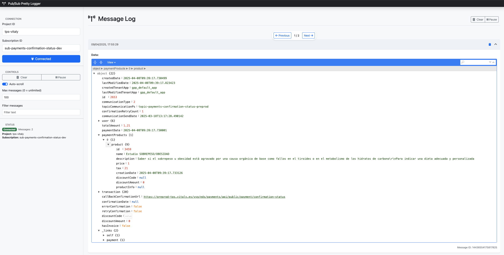
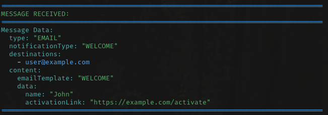
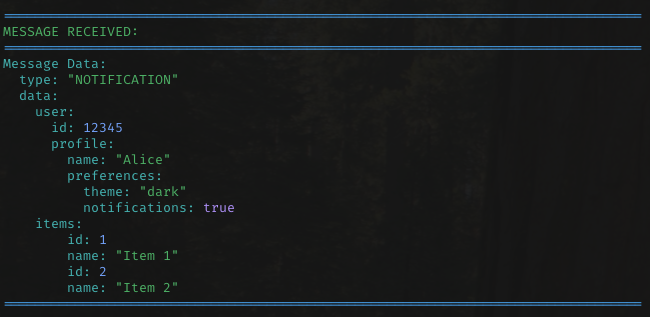

# 🌈 Pub/Sub Pretty Logger

<div align="center">
  
  
  
</div>

A beautiful, colorful, and dynamic tool for monitoring Google Cloud Pub/Sub messages in real-time. Transform your console output from plain text to a structured, color-coded display that makes debugging and monitoring a breeze.

## ✨ Features

- 🎨 **Beautiful Colorized Output**: Different colors for different data types (strings, numbers, booleans, etc.)
- 🔄 **Dynamic Message Handling**: Works with any Pub/Sub message structure automatically
- 🧩 **Nested JSON Support**: Properly formats and displays nested JSON structures with indentation
- 🔌 **Flexible Configuration**: Configure via command line, environment variables, or .env files
- 🔍 **Attribute Display**: Shows both message data and message attributes
- 🌐 **Cross-Platform**: Works on Windows, macOS, and Linux
- 🖥️ **Web Interface**: Beautiful and intuitive web interface with Vue.js and FastAPI
- 📤 **Message Publishing**: Send messages to Pub/Sub topics directly from the web interface
- 🌓 **Dark Mode**: Toggle between light and dark themes for comfortable viewing
- 📱 **Responsive Design**: Works seamlessly on desktop, tablet, and mobile devices
- 🧭 **Message Navigation**: Easily browse through messages with sticky navigation controls
- ↔️ **Customizable Layout**: Resize the sidebar to optimize your workspace
- 🔄 **Multiple Subscriptions**: Connect to and monitor multiple Pub/Sub subscriptions simultaneously

## 🏗️ Technical Architecture

For detailed information about the application's technical architecture, please see [system_architecture.md](system_architecture.md).

## 📋 Prerequisites

- Python 3.8+
- Google Cloud project with Pub/Sub subscription
- Google Cloud credentials configured
- uv package manager (recommended)

## 🚀 Installation and Setup

### Install uv (if not already installed)

```bash
# Install uv using the official installer
curl -LsSf https://astral.sh/uv/install.sh | sh

# Or on Windows (PowerShell)
irm https://astral.sh/uv/install.ps1 | iex
```

### Using Quickstart Script (Recommended)

On macOS/Linux, you can use the provided quickstart script to set up everything automatically:

```bash
# Clone this repository
git clone https://github.com/pedroid999/pubsub-pretty-logger.git
cd pubsub-pretty-logger

# Make the script executable
chmod +x ./quickstart.sh

# Run the quickstart script
./quickstart.sh
```

The script will:
- Check if uv is installed
- Create and activate a virtual environment
- Install all dependencies
- Create a .env file from the template if it doesn't exist
- Start the web interface automatically

### Manual Setup

1. Clone this repository:
   ```bash
   git clone https://github.com/pedroid999/pubsub-pretty-logger.git
   cd pubsub-pretty-logger
   ```

2. Create a virtual environment and install dependencies using uv:
   ```bash
   # Create a new virtual environment
   uv venv

   # Activate it on macOS/Linux
   source .venv/bin/activate

   # Or on Windows
   .venv\Scripts\activate

   # Install dependencies from pyproject.toml
   uv sync
   ```

3. Set up your Google Cloud credentials:
   ```bash
   # Option 1: Set environment variable
   export GOOGLE_APPLICATION_CREDENTIALS="/path/to/your/credentials.json"
   
   # Option 2: Add to .env file (see Configuration section)
   ```

4. Configure your environment:
   ```bash
   # Create a .env file from the example
   cp .env.example .env
   
   # Edit with your specific settings
   # PUBSUB_PROJECT_ID=your-project-id
   # PUBSUB_SUBSCRIPTION_ID=your-subscription-id
   ```

5. Start the application:
   ```bash
   # For web interface (recommended)
   uv run pubsub_logger.py --web
   
   # For command-line interface
   uv run pubsub_logger.py
   ```

6. For web interface, open your browser at:
   ```
   http://localhost:8000
   ```

### Troubleshooting Setup Issues

If you encounter problems or want to start with a completely clean setup:

1. Clean any Python cache files:
   ```bash
   # On macOS/Linux
   find . -name "__pycache__" -exec rm -rf {} +
   find . -name "*.pyc" -delete
   
   # On Windows PowerShell
   Get-ChildItem -Path . -Include "__pycache__" -Recurse -Directory | Remove-Item -Recurse -Force
   Get-ChildItem -Path . -Include "*.pyc" -Recurse -File | Remove-Item -Force
   ```

2. Verify your configuration:
   - Check that your `.env` file contains the correct values
   - Ensure your Google Cloud credentials file exists and is valid
   - Verify your project and subscription IDs in the Google Cloud Console

3. Check for common issues:
   - Review terminal output for error messages
   - Verify your Google Cloud permissions
   - Ensure your Pub/Sub subscription exists and is accessible
   - Make sure all dependencies are installed correctly using `uv sync`

## ⚙️ Configuration

You can configure the tool in several ways:

### 1. Using a .env file (recommended)

Create a `.env` file based on the provided `.env.example`:

```bash
cp .env.example .env
```

Then edit the `.env` file with your specific configuration:

```
PUBSUB_PROJECT_ID=your-project-id
PUBSUB_SUBSCRIPTION_ID=your-subscription-id
GOOGLE_APPLICATION_CREDENTIALS=/path/to/your/credentials.json
```

### 2. Using environment variables

Set the environment variables directly:

```bash
export PUBSUB_PROJECT_ID=your-project-id
export PUBSUB_SUBSCRIPTION_ID=your-subscription-id
export GOOGLE_APPLICATION_CREDENTIALS=/path/to/your/credentials.json
```

### 3. Using command line arguments

```bash
# Single subscription
uv run pubsub_logger.py --project-id=your-project-id --subscription-id=your-subscription-id

# Multiple subscriptions
uv run pubsub_logger.py --subscriptions project1:subscription1 project2:subscription2
```

## 🖥️ Usage

### CLI Mode (Command Line Interface)

```bash
uv run pubsub_logger.py
```

### Web Interface Mode

```bash
uv run pubsub_logger.py --web
```

This starts a beautiful web interface on http://127.0.0.1:8000 by default.

You can specify a different port if needed:

```bash
uv run pubsub_logger.py --web --port=8080
```### With command line options

```bash
# Single subscription
uv run pubsub_logger.py --project-id=your-project-id --subscription-id=your-subscription-id

# Multiple subscriptions
uv run pubsub_logger.py --subscriptions project1:subscription1 project2:subscription2
```

### Using a specific .env file

```bash
uv run pubsub_logger.py --env-file=.env.production
```

### Disable colored output (CLI mode only)

```bash
uv run pubsub_logger.py --no-color
```

## 🛠️ Command Line Options

| Option | Description |
|--------|-------------|
| `--project-id` | Google Cloud project ID |
| `--subscription-id` | Pub/Sub subscription ID |
| `--subscriptions` | Multiple Pub/Sub subscriptions in format: project1:subscription1 project2:subscription2 |
| `--env-file` | Path to a specific .env file |
| `--no-color` | Disable colored output (CLI mode only) |
| `--web` | Start the web interface instead of CLI mode |
| `--port` | Port for web interface (default: 8000) |

## 🎨 Color Scheme (CLI Mode)

The CLI mode uses different colors to make it easier to identify different types of data:

- 🟢 **Green**: Strings
- 🔵 **Blue**: Numbers
- 🟣 **Magenta**: Booleans
- 🔴 **Red**: Null values
- 🟡 **Yellow**: Field names
- 🔵 **Cyan**: Array items and separators

## 🌐 Web Interface

The web interface provides a modern, user-friendly way to monitor Pub/Sub messages with additional features:

- 📱 **Responsive Design**: Works on desktop, tablet, and mobile devices
- 🔍 **Message Filtering**: Filter messages based on content
- ⏯️ **Pause/Resume**: Control message flow
- 📋 **Copy to Clipboard**: Easily copy message content
- 🔄 **Auto-scroll**: Automatic scrolling to latest messages
- 🌳 **JSON Tree View**: Interactive JSON viewer for message content
- 📊 **Message Statistics**: Track message counts and flow
- 🌓 **Dark Mode**: Toggle between light and dark themes for comfortable viewing in any environment
- 🔗 **Multiple Subscriptions**: Connect to multiple Pub/Sub subscriptions simultaneously

### Web Interface Installation and Setup

To use the web interface, follow these steps:

1. Make sure you've installed all required dependencies:
   ```bash
   uv sync
   ```

2. Configure your Google Cloud credentials and Pub/Sub settings in your `.env` file as described in the Configuration section.

3. Start the web interface in one of the following ways:

   **Option 1:** Using the main script with the `--web` flag:
   ```bash
   uv run pubsub_logger.py --web
   ```

   **Option 2:** Using the dedicated web script:
   ```bash
   uv run run_web.py
   ```

4. Once started, open your browser and navigate to:
   ```
   http://localhost:8000
   ```

5. In the web interface:
   - Enter your Project ID and Subscription ID (or they'll be auto-filled from your .env file)
   - Click "Connect" to start receiving messages
   - Add additional subscriptions without disconnecting existing ones
   - Filter messages by subscription source
   - Use the sidebar controls to filter, pause/resume, or clear messages
   - Click on any message to expand and view its contents
   - Toggle between light and dark mode using the switch in the header
   - Publish messages to any Pub/Sub topic using the publishing panel in the sidebar

The web server features hot reloading, so any changes to the code will automatically restart the server.

### Publishing Messages

The web interface includes a powerful Pub/Sub publishing feature:

- 🔍 **Project and Topic Autocomplete**: Easily find and select your GCP projects and topics
- 📝 **JSON Editor**: Write your message payload with proper JSON formatting
- 🚀 **One-Click Publishing**: Send messages directly to Pub/Sub topics
- 📨 **Success Confirmation**: Get immediate feedback on successful message delivery
- 🔄 **Testing Workflows**: Test your entire Pub/Sub workflow by publishing and then viewing the received message

### Dark Mode

The web interface includes a dark mode feature for comfortable viewing in low-light environments:

- 🔄 **Theme Toggle**: Switch between light and dark themes using the toggle in the header
- 💾 **Preference Saving**: Your theme preference is saved and persists between sessions
- 🎨 **Consistent Styling**: All UI components and JSON editor are styled appropriately for both themes
- 🖥️ **Responsive**: Dark mode works seamlessly across all device sizes

### Multiple Subscriptions

Connect to and monitor multiple Pub/Sub subscriptions simultaneously:

- ➕ **Add Subscriptions**: Add new subscriptions without disconnecting existing ones
- 🏷️ **Subscription Labels**: Each message displays which subscription it came from
- 🔍 **Subscription Filtering**: Filter the message view by subscription
- 🔌 **Individual Disconnect**: Remove specific subscriptions without affecting others
- 💻 **CLI Support**: Use multiple subscriptions in command-line mode as well

### Web Interface Screenshots


*Screenshot of the Pub/Sub Pretty Logger Web Interface showing message details and JSON formatting*


## 📚 Examples

### Example 1: Email Notification



### Example 2: Notification with Nested Structure



## 🔄 Recent Changes

### Latest Commits (as of 2025-04-17)

- 6ca94ad: Refactor message navigation styles for improved UI and responsiveness
- 4f7362e: Update layout and styles for improved sidebar and main content responsiveness
- e46676d: Add Pub/Sub publishing functionality and sidebar resizer
- 7c65a20: Enhance mobile responsiveness and UI transitions
- f07ad59: Enhance WebSocket and message handling with subscription details
- 0044d55: Enhance autocomplete functionality with keyboard navigation support
- 98a51fb: Add GCP project and subscription management with autocomplete feature
- 6120e28: Implement dark mode feature with toggle functionality

### New Features

- 🧭 **Fixed Message Navigation**: Sticky message navigation that remains visible while scrolling through messages
- 📤 **Pub/Sub Publishing**: Send messages directly to Pub/Sub topics from the web interface
- ↔️ **Resizable Sidebar**: Customize your workspace by adjusting the sidebar width
- 🎮 **Keyboard Navigation**: Navigate through autocomplete suggestions using keyboard controls
- 🌑 **Enhanced Dark Mode**: Improved dark mode support for JSONEditor with better readability and contrast
- 📱 **Improved Mobile Responsiveness**: Better layout and user experience on smaller screens and devices

## 🤝 Contributing

Contributions are welcome! Feel free to open issues or submit pull requests.

1. Fork the repository
2. Create your feature branch (`git checkout -b feature/amazing-feature`)
3. Commit your changes (`git commit -m 'Add some amazing feature'`)
4. Push to the branch (`git push origin feature/amazing-feature`)
5. Open a Pull Request

## 📄 License

This project is licensed under the MIT License - see the LICENSE file for details.

## 🙏 Acknowledgements

- [Google Cloud Pub/Sub](https://cloud.google.com/pubsub/docs/overview)
- [Colorama](https://pypi.org/project/colorama/) for the terminal colors
- [python-dotenv](https://pypi.org/project/python-dotenv/) for environment variable management
- [FastAPI](https://fastapi.tiangolo.com/) for the web API framework
- [Vue.js](https://vuejs.org/) for the reactive web interface
- [JSONEditor](https://github.com/josdejong/jsoneditor) for JSON visualization 
- [uv](https://astral.sh/uv) for fast, reliable Python package management 

