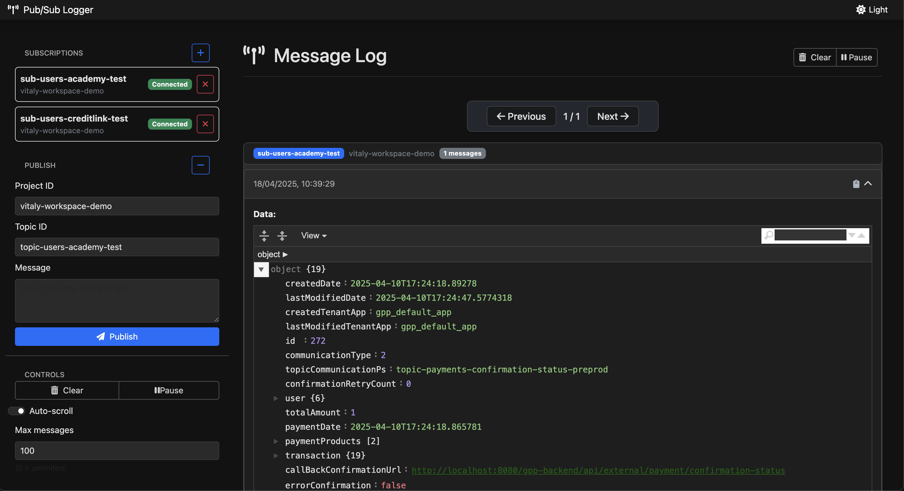

# 🌈 Pub/Sub Pretty Logger

<div align="center">
  
  
  
</div>

A beautiful, colorful, and dynamic tool for monitoring Google Cloud Pub/Sub messages in real-time. Transform your console output from plain text to a structured, color-coded display that makes debugging and monitoring a breeze.

## ✨ Features

- 🎨 **Beautiful Colorized Output**: Different colors for different data types (strings, numbers, booleans, etc.)
- 🔄 **Dynamic Message Handling**: Works with any Pub/Sub message structure automatically
- 🧩 **Nested JSON Support**: Properly formats and displays nested JSON structures with indentation
- 🔌 **Flexible Configuration**: Configure via command line, environment variables, or .env files
- 🔍 **Attribute Display**: Shows both message data and message attributes
- 🌐 **Cross-Platform**: Works on Windows, macOS, and Linux
- 🖥️ **Web Interface**: Beautiful and intuitive web interface with Vue.js and FastAPI

## 📋 Prerequisites

- Python 3.7+
- Google Cloud project with Pub/Sub subscription
- Google Cloud credentials configured

## 🚀 Installation and Setup

### Quick Start

1. Clone this repository:
   ```bash
   git clone https://github.com/pedroid999/pubsub-pretty-logger.git
   cd pubsub-pretty-logger
   ```

2. Create a virtual environment (recommended):
   ```bash
   # Create a new virtual environment
   python -m venv venv
   
   # Activate it on macOS/Linux
   source venv/bin/activate
   
   # Or on Windows
   venv\Scripts\activate
   ```

3. Install the required dependencies:
   ```bash
   pip install -r requirements.txt
   ```

4. Set up your Google Cloud credentials:
   ```bash
   # Option 1: Set environment variable
   export GOOGLE_APPLICATION_CREDENTIALS="/path/to/your/credentials.json"
   
   # Option 2: Add to .env file (see Configuration section)
   ```

5. Configure your environment:
   ```bash
   # Create a .env file from the example
   cp .env.example .env
   
   # Edit with your specific settings
   # PUBSUB_PROJECT_ID=your-project-id
   # PUBSUB_SUBSCRIPTION_ID=your-subscription-id
   ```

6. Start the application:
   ```bash
   # For web interface (recommended)
   python pubsub_logger.py --web
   
   # For command-line interface
   python pubsub_logger.py
   ```

7. For web interface, open your browser at:
   ```
   http://localhost:8000
   ```

### Troubleshooting Setup Issues

If you encounter problems or want to start with a completely clean setup:

1. Clean any Python cache files:
   ```bash
   # On macOS/Linux
   find . -name "__pycache__" -exec rm -rf {} +
   find . -name "*.pyc" -delete
   
   # On Windows PowerShell
   Get-ChildItem -Path . -Include "__pycache__" -Recurse -Directory | Remove-Item -Recurse -Force
   Get-ChildItem -Path . -Include "*.pyc" -Recurse -File | Remove-Item -Force
   ```

2. Verify your configuration:
   - Check that your `.env` file contains the correct values
   - Ensure your Google Cloud credentials file exists and is valid
   - Verify your project and subscription IDs in the Google Cloud Console

3. Check for common issues:
   - Review terminal output for error messages
   - Verify your Google Cloud permissions
   - Ensure your Pub/Sub subscription exists and is accessible
   - Make sure all dependencies are installed correctly

## ⚙️ Configuration

You can configure the tool in several ways:

### 1. Using a .env file (recommended)

Create a `.env` file based on the provided `.env.example`:

```bash
cp .env.example .env
```

Then edit the `.env` file with your specific configuration:

```
PUBSUB_PROJECT_ID=your-project-id
PUBSUB_SUBSCRIPTION_ID=your-subscription-id
GOOGLE_APPLICATION_CREDENTIALS=/path/to/your/credentials.json
```

### 2. Using environment variables

Set the environment variables directly:

```bash
export PUBSUB_PROJECT_ID=your-project-id
export PUBSUB_SUBSCRIPTION_ID=your-subscription-id
export GOOGLE_APPLICATION_CREDENTIALS=/path/to/your/credentials.json
```

### 3. Using command line arguments

```bash
python pubsub_logger.py --project-id=your-project-id --subscription-id=your-subscription-id
```

## 🖥️ Usage

### CLI Mode (Command Line Interface)

```bash
python pubsub_logger.py
```

### Web Interface Mode

```bash
python pubsub_logger.py --web
```

This starts a beautiful web interface on http://127.0.0.1:8000 by default.

You can specify a different port if needed:

```bash
python pubsub_logger.py --web --port=8080
```

### With command line options

```bash
python pubsub_logger.py --project-id=your-project-id --subscription-id=your-subscription-id
```

### Using a specific .env file

```bash
python pubsub_logger.py --env-file=.env.production
```

### Disable colored output (CLI mode only)

```bash
python pubsub_logger.py --no-color
```

## 🛠️ Command Line Options

| Option | Description |
|--------|-------------|
| `--project-id` | Google Cloud project ID |
| `--subscription-id` | Pub/Sub subscription ID |
| `--env-file` | Path to a specific .env file |
| `--no-color` | Disable colored output (CLI mode only) |
| `--web` | Start the web interface instead of CLI mode |
| `--port` | Port for web interface (default: 8000) |

## 🎨 Color Scheme (CLI Mode)

The CLI mode uses different colors to make it easier to identify different types of data:

- 🟢 **Green**: Strings
- 🔵 **Blue**: Numbers
- 🟣 **Magenta**: Booleans
- 🔴 **Red**: Null values
- 🟡 **Yellow**: Field names
- 🔵 **Cyan**: Array items and separators

## 🌐 Web Interface

The web interface provides a modern, user-friendly way to monitor Pub/Sub messages with additional features:

- 📱 **Responsive Design**: Works on desktop, tablet, and mobile devices
- 🔍 **Message Filtering**: Filter messages based on content
- ⏯️ **Pause/Resume**: Control message flow
- 📋 **Copy to Clipboard**: Easily copy message content
- 🔄 **Auto-scroll**: Automatic scrolling to latest messages
- 🌳 **JSON Tree View**: Interactive JSON viewer for message content
- 📊 **Message Statistics**: Track message counts and flow

### Web Interface Installation and Setup

To use the web interface, follow these steps:

1. Make sure you've installed all required dependencies:
   ```bash
   pip install -r requirements.txt
   ```

2. Configure your Google Cloud credentials and Pub/Sub settings in your `.env` file as described in the Configuration section.

3. Start the web interface in one of the following ways:

   **Option 1:** Using the main script with the `--web` flag:
   ```bash
   python pubsub_logger.py --web
   ```

   **Option 2:** Using the dedicated web script (more convenient):
   ```bash
   # Make the script executable first (on macOS/Linux)
   chmod +x run_web.py
   
   # Then run it
   ./run_web.py
   ```

   **Option 3:** Running the web script with python:
   ```bash
   python run_web.py
   ```

4. Once started, open your browser and navigate to:
   ```
   http://localhost:8000
   ```

5. In the web interface:
   - Enter your Project ID and Subscription ID (or they'll be auto-filled from your .env file)
   - Click "Connect" to start receiving messages
   - Use the sidebar controls to filter, pause/resume, or clear messages
   - Click on any message to expand and view its contents

The web server features hot reloading, so any changes to the code will automatically restart the server.

### Web Interface Screenshots


*Screenshot of the Pub/Sub Pretty Logger Web Interface showing message details and JSON formatting*


## 📚 Examples

### Example 1: Email Notification


### Example 2: Notification with Nested Structure


## 🤝 Contributing

Contributions are welcome! Feel free to open issues or submit pull requests.

1. Fork the repository
2. Create your feature branch (`git checkout -b feature/amazing-feature`)
3. Commit your changes (`git commit -m 'Add some amazing feature'`)
4. Push to the branch (`git push origin feature/amazing-feature`)
5. Open a Pull Request

## 📄 License

This project is licensed under the MIT License - see the LICENSE file for details.

## 🙏 Acknowledgements

- [Google Cloud Pub/Sub](https://cloud.google.com/pubsub/docs/overview)
- [Colorama](https://pypi.org/project/colorama/) for the terminal colors
- [python-dotenv](https://pypi.org/project/python-dotenv/) for environment variable management
- [FastAPI](https://fastapi.tiangolo.com/) for the web API framework
- [Vue.js](https://vuejs.org/) for the reactive web interface
- [JSONEditor](https://github.com/josdejong/jsoneditor) for JSON visualization 